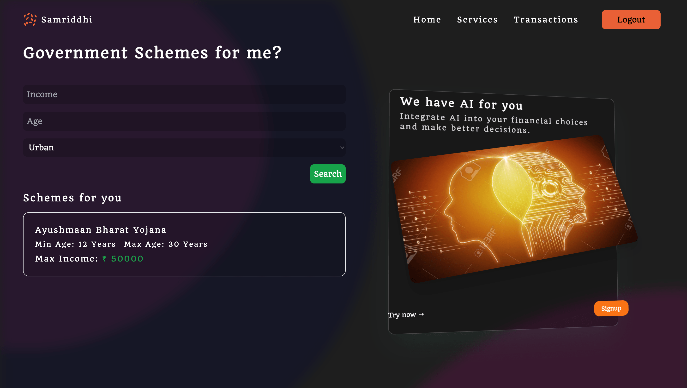
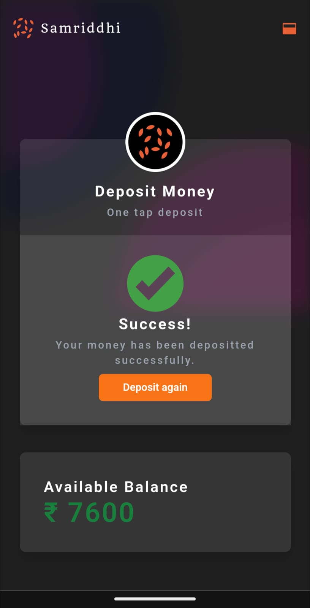
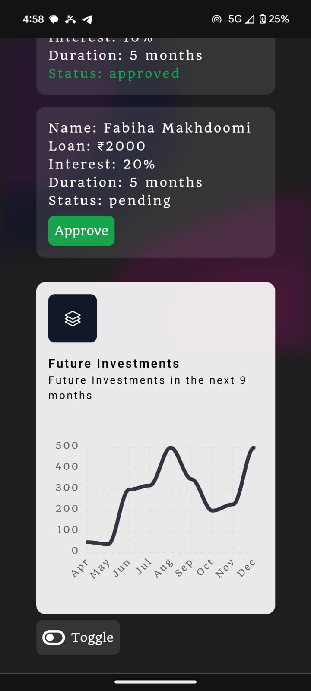

# Samriddhi Financial Application

## Overview

Samriddhi is a full-stack financial application built using the MERN stack (MongoDB, Express.js, React.js, Node.js) along with Framer Motion, Atropos, and Tailwind CSS. It aims to revolutionize financial services by offering digital payments, fund management, insurance integration, and enhanced security features.

## Features

1. **Auth (Signup/Login):** Secure authentication system for users to sign up and log in to their accounts.
2. **Create, Join, Manage Funds:** Ability to create, join, and manage funds with rotating roles for fund managers.
3. **Join the Fund using QR Code:** Conveniently join funds using QR codes for seamless integration.
4. **Loan (Request/Approve Loans):** Facilitates loan requests and approvals within the application.
5. **Withdraw/Deposit Money:** Easy withdrawal and deposit of money from user accounts.
6. **SMS UPI Payment (API):** Integration with SMS-based UPI payment system for efficient transactions.
7. **Get Government Schemes:** Access government schemes and benefits through integrated APIs.
8. **Interest Calculator:** Calculate interest rates for loans and investments.
9. **Proportional Interest:** Manage proportional interest calculations for funds and investments.
10. **Automatic Fund Selector for Loans:** Automated fund selection based on loan requirements and criteria.
11. **AI Assistant for Financial Consultation:** AI-driven financial consultation services for users.
12. **Risk Assessment for Loan Amount:** Assess loan amounts based on risk factors and user data.
13. **Mostly Responsive Design (Both PC and Mobile View):** Ensures a responsive design for both desktop and mobile users.

## UI
### Desktop Landing Page


### Get Government Schemes


### Mobile Views
<div style="display: flex; justify-content: space-between;">
   
   
</div>

## Technologies Used

- **Frontend:** React.js, Framer Motion, Atropos, Tailwind CSS, Aceternity UI
- **Backend:** Node.js, Express.js
- **Database:** MongoDB
- **Authentication:** JWT (JSON Web Tokens)
- **Security:** HTTPS, Secure PINs, Voice Recognition

## Getting Started

To run the application locally, follow these steps:

1. Clone the repository:
   ```bash
   git clone https://github.com/whysosaket/samriddhi.git
   ```

2. Navigate to the project directory:
   ```bash
   cd samriddhi
   ```

3. Install dependencies for both frontend and backend:
   ```bash
   cd client
   npm install

   cd ../server
   npm install
   ```

4. Set up environment variables:
   - Create a `.env` file in the backend directory.
   - Add necessary environment variables (e.g., MongoDB URI, JWT secret, etc.).

5. Start the development server for both frontend and backend:
   ```bash
   cd client
   npm run dev

   cd ../server
   npm run dev
   ```

6. Access the application in your browser at `http://localhost:5173`.

---

Feel free to customize and expand upon this README as needed for your project documentation. If you have any specific requirements or questions, let me know!
